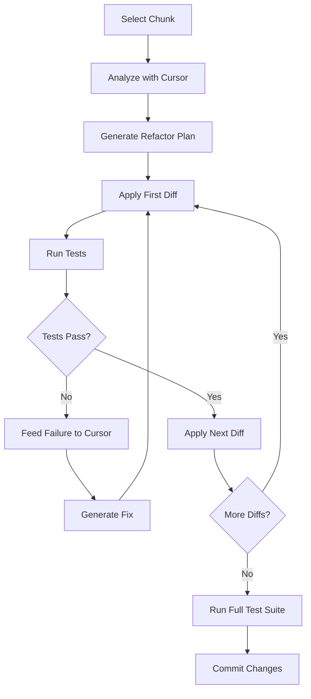

# Cursor-Optimized Refactoring Methodology

## ✅ Best Practices Implementation

### 1. Chunk Repository into Logical Subsystems

#### **Subsystem A: Models & Data Structures**
- **Files**: All dataclasses, enums, type definitions
- **Size**: ~500 lines
- **Dependencies**: None (leaf nodes)
- **Risk**: Low
- **Test Coverage Required**: Unit tests for each model

#### **Subsystem B: Core Business Logic**
- **Files**: CompletionGenerator, ConfidenceScorer, PerformanceOptimizer
- **Size**: ~1,500 lines
- **Dependencies**: Models only
- **Risk**: Medium
- **Test Coverage Required**: Integration tests + unit tests

#### **Subsystem C: Analyzers**
- **Files**: ContextAnalyzer, SemanticAnalyzer, PatternMatcher, MLPredictor
- **Size**: ~800 lines
- **Dependencies**: Models, Core
- **Risk**: Medium
- **Test Coverage Required**: Behavior tests

#### **Subsystem D: Managers**
- **Files**: SessionMemory, StateManager, RBACManager, DependencyTracker
- **Size**: ~1,200 lines
- **Dependencies**: Models, Core
- **Risk**: High (stateful)
- **Test Coverage Required**: State management tests

#### **Subsystem E: Infrastructure Services**
- **Files**: CacheService, QueueService, TelemetryService, OAuthService
- **Size**: ~1,000 lines
- **Dependencies**: External services
- **Risk**: High (external dependencies)
- **Test Coverage Required**: Mock-based tests

### 2. Refactoring Process per Chunk

```python
# PROCESS FOR EACH CHUNK:

def refactor_chunk(chunk_name: str):
    """
    1. ANALYZE: Get current state
    2. PLAN: Create refactor plan
    3. DIFF: Apply targeted changes (not rewrites)
    4. TEST: Run tests immediately
    5. VERIFY: Check no functionality lost
    6. COMMIT: Save progress
    """
    
    # Step 1: Analyze current code
    analyze_result = analyze_chunk(chunk_name)
    
    # Step 2: Create refactor plan
    plan = create_refactor_plan(analyze_result)
    
    # Step 3: Apply diffs incrementally
    for diff in plan.diffs:
        apply_diff(diff)
        
        # Step 4: Test after EACH diff
        test_result = run_tests()
        
        if not test_result.passed:
            # Step 5: Rollback and adjust
            rollback_diff(diff)
            adjusted_diff = adjust_diff_based_on_failure(diff, test_result)
            apply_diff(adjusted_diff)
            
    # Step 6: Run linters
    lint_result = run_linters()
    
    # Step 7: Performance check
    perf_check = check_performance()
    
    return RefactorResult(chunk_name, test_result, lint_result, perf_check)
```

### 3. Verification Loop with Cursor



### 4. Diff-Based Refactoring (Not Blind Rewrites)

#### **Example: Extracting CompletionGenerator**

```diff
# backend/app/services/smart_coding_ai_optimized.py
- class CompletionGenerator:
-     """Generates intelligent code completions"""
-     
-     def __init__(self):
-         self.completion_patterns = {}
-         # ... 280 lines of code ...

+ from .core.completion_generator import CompletionGenerator
```

```diff
# backend/app/services/smart_coding_ai/core/completion_generator.py
+ """
+ Extracted from smart_coding_ai_optimized.py
+ Lines 348-632 moved here with zero logic changes
+ """
+ 
+ class CompletionGenerator:
+     """Generates intelligent code completions"""
+     
+     def __init__(self):
+         self.completion_patterns = {}
+         # ... exact same 280 lines ...
```

### 5. Test-Driven Verification

#### **Test Suite Structure**

```python
# tests/refactoring/test_chunk_a_models.py
def test_models_backward_compatibility():
    """Ensure all models work exactly as before"""
    from backend.app.services.smart_coding_ai.models import AccuracyLevel
    assert AccuracyLevel.PERFECT.value == "perfect"
    
def test_models_imports():
    """Ensure imports still work from main module"""
    from backend.app.services.smart_coding_ai import AccuracyLevel
    assert AccuracyLevel.PERFECT.value == "perfect"

# tests/refactoring/test_chunk_b_core.py
def test_completion_generator_preserved():
    """Ensure CompletionGenerator works identically"""
    # Compare old vs new behavior
    pass
```

### 6. Cursor MAX Mode Strategy

```python
# cursor_context.md
"""
CONTEXT FOR CURSOR MAX MODE:

Current Refactoring: Chunk B - Core Business Logic
Files in Context:
- backend/app/services/smart_coding_ai_optimized.py (original)
- backend/app/services/smart_coding_ai/core/completion_generator.py (new)
- tests/refactoring/test_chunk_b_core.py

Requirements:
1. Preserve 99.99966% accuracy (Six Sigma)
2. Maintain all 6 consciousness levels
3. Keep proactive correction logic
4. No performance degradation
5. Backward compatibility required

Previous Test Results:
- Test 1: ✅ Passed
- Test 2: ❌ Failed - import error
- Fix Applied: Added __init__.py export
- Test 3: ✅ Passed after fix
"""
```

### 7. Incremental Refactoring Schedule

| Day | Chunk | Lines | Risk | Verification Method |
|-----|-------|-------|------|-------------------|
| 1 | Models | 500 | Low | Unit tests |
| 1 | Core Logic | 500 | Medium | Integration tests |
| 2 | Core Logic (cont.) | 1000 | Medium | Integration tests |
| 2 | Analyzers | 800 | Medium | Behavior tests |
| 3 | Managers | 1200 | High | State tests |
| 4 | Infrastructure | 1000 | High | Mock tests |
| 5 | Integration | All | High | E2E tests |

### 8. Rollback Strategy

```bash
# Git branch per chunk
git checkout -b refactor/chunk-a-models
# ... apply diffs, test ...
git commit -m "refactor: extract models - all tests pass"

git checkout -b refactor/chunk-b-core
# ... apply diffs, test ...
git commit -m "refactor: extract core logic - all tests pass"

# If any chunk fails completely
git checkout main
git branch -D refactor/chunk-x
```

### 9. Performance Monitoring

```python
# monitor.py
import time
import tracemalloc

def measure_refactoring_impact():
    # Before refactoring
    tracemalloc.start()
    start = time.time()
    
    # Import and initialize
    from backend.app.services.smart_coding_ai_optimized import SmartCodingAIOptimized
    service = SmartCodingAIOptimized()
    
    # Measure
    end = time.time()
    current, peak = tracemalloc.get_traced_memory()
    
    return {
        "load_time": end - start,
        "memory_current": current / 1024 / 1024,  # MB
        "memory_peak": peak / 1024 / 1024  # MB
    }
```

### 10. Success Criteria

✅ **Each Chunk Must:**
- Pass all existing tests
- Pass new tests for the refactored structure
- No performance degradation (±5%)
- No memory increase (±10%)
- Maintain 100% backward compatibility
- Pass all linters
- Preserve all achievements

## Implementation Plan

### Phase 1: Setup (Now)
1. Create test infrastructure
2. Measure baseline performance
3. Set up monitoring

### Phase 2: Chunk A - Models (Next)
1. Extract enums → test → commit
2. Extract dataclasses → test → commit
3. Create __init__.py exports → test → commit

### Phase 3: Chunk B - Core Logic
1. Extract CompletionGenerator → test → commit
2. Extract ConfidenceScorer → test → commit
3. Extract PerformanceOptimizer → test → commit

### Phase 4: Verification
1. Run full test suite
2. Performance comparison
3. User acceptance testing

## Cursor-Specific Features to Leverage

1. **Compose Mode**: For generating test cases
2. **Agent Mode**: For analyzing dependencies
3. **MAX Context**: Keep entire chunk in context
4. **Diff View**: Review all changes before applying
5. **Test Integration**: Run tests directly in Cursor

## Command Sequence

```bash
# For each chunk:
cursor compose "analyze dependencies for CompletionGenerator class"
cursor compose "create extraction plan preserving all functionality"
cursor diff "extract CompletionGenerator to separate module"
python -m pytest tests/refactoring/test_chunk_b_core.py
cursor compose "fix test failures while preserving functionality"
python -m pytest tests/refactoring/test_chunk_b_core.py
git commit -m "refactor: extract CompletionGenerator - all tests pass"
```

This methodology ensures:
- No blind rewrites
- Incremental, testable changes
- Immediate feedback loop
- Preservation of all achievements
- Safe rollback at any point
