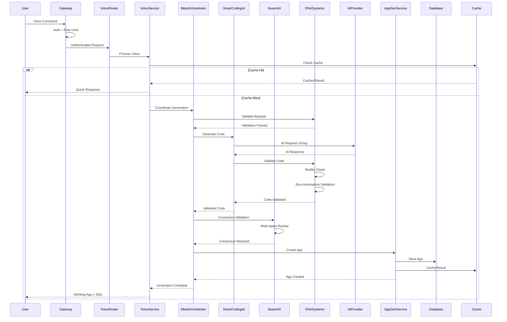
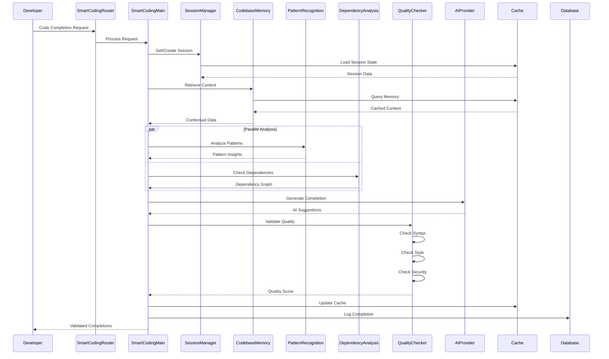
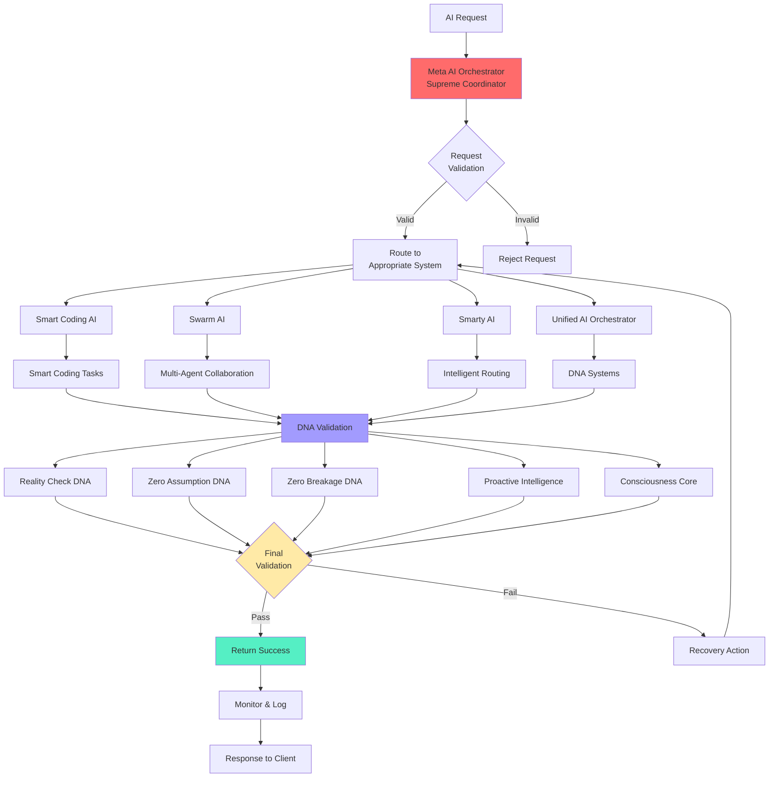
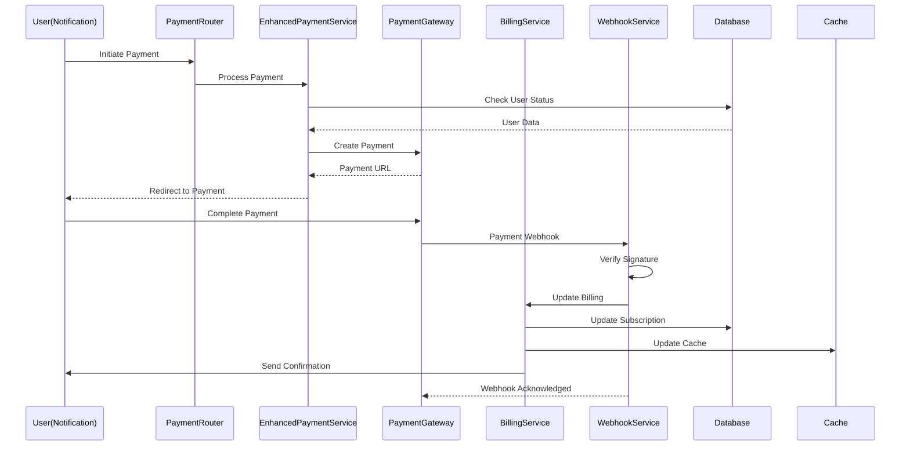
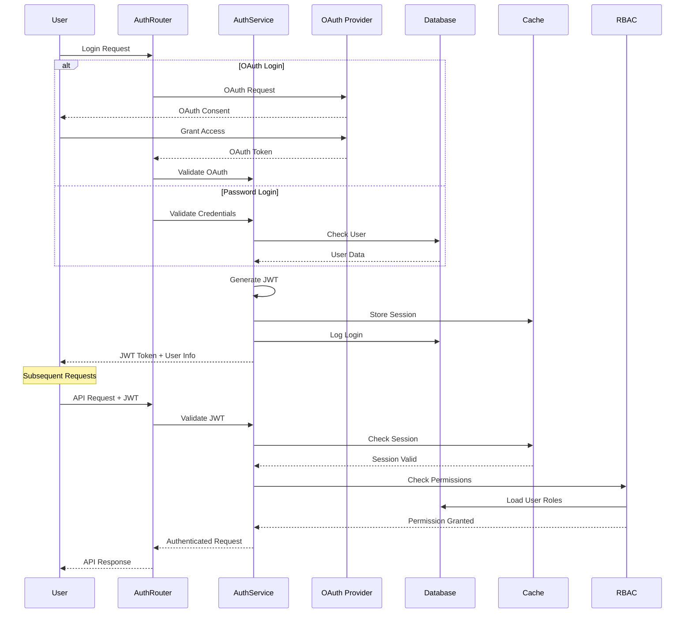
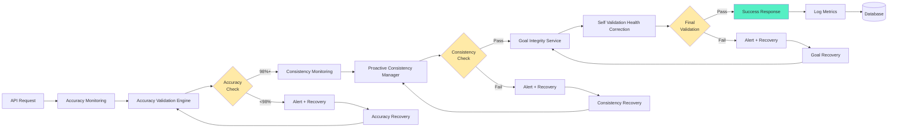
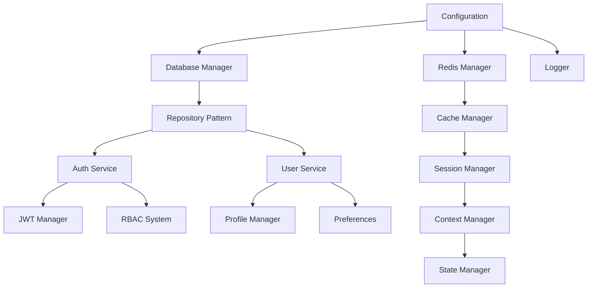
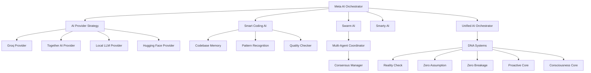
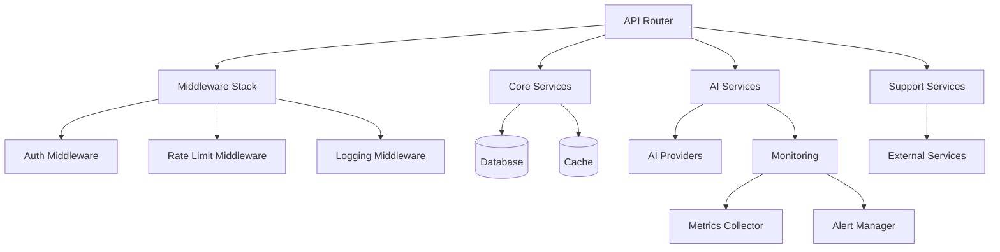
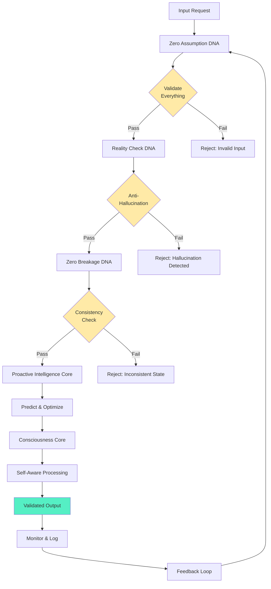

# Cognomega AI - Component Interactions & Data Flows

> **Generated**: October 9, 2025  
> **Purpose**: Detailed component interaction patterns and data flows

## 📊 Component Interaction Patterns

### 1. Voice-to-App Generation Flow



### 2. Smart Coding AI Code Completion Flow



### 3. AI Orchestration Hierarchy Flow



### 4. Payment Processing Flow



### 5. Authentication & Authorization Flow



### 6. Monitoring & Validation Pipeline



## 🔄 Data Flow Patterns

### 1. Request-Response Pattern

```
Client → Gateway → Router → Service → Database → Service → Router → Gateway → Client
                                  ↓
                                Cache (Read/Write)
```

### 2. Event-Driven Pattern

```
Event Trigger → Observer → Command → Service → Database
                  ↓
            Multiple Observers → Multiple Handlers
```

### 3. AI Orchestration Pattern

```
Request → Meta Orchestrator → AI System Selection → DNA Validation
                   ↓                    ↓                    ↓
            Priority Queue      AI Provider         Multi-Layer Check
                   ↓                    ↓                    ↓
            Task Distribution    Response Cache      Result Validation
```

### 4. Caching Strategy

```
Request → Check L1 Cache (Memory) → Check L2 Cache (Redis) → Database
              ↓                           ↓                       ↓
         Cache Hit                   Cache Hit              Cache Miss
              ↓                           ↓                       ↓
         Return Result            Return Result        Write to Cache → Return
```

### 5. DNA Validation Pipeline

```
Input → Zero Assumption DNA → Reality Check DNA → Zero Breakage DNA
          ↓                        ↓                      ↓
    Validate Input          Anti-Hallucination    Consistency Check
          ↓                        ↓                      ↓
    Check All Fields        Multi-Source Verify    State Validation
          ↓                        ↓                      ↓
    → Proactive Intelligence Core → Consciousness Core → Output
              ↓                           ↓
      Predict Needs                Self-Modification Check
```

## 🎯 Component Dependencies

### Core Dependencies



### AI System Dependencies



### Service Layer Dependencies



## 📦 Module Interaction Patterns

### 1. Repository Pattern Usage

```python
# Pattern: Repository abstracts data access
Router → Service → Repository → Database
                      ↓
                 Interface (Abstract)
                      ↓
              Concrete Implementation
```

**Example Flow:**
```
UserRouter → UserService → UserRepository → Supabase
                              ↓
                      IUserRepository (Interface)
                              ↓
                    SupabaseUserRepository (Concrete)
```

### 2. Strategy Pattern Usage

```python
# Pattern: Strategy defines algorithm family
AI Service → AI Provider Strategy → Concrete Provider
                     ↓
              Provider Interface
                     ↓
         [Groq, Together, Local, HF]
```

**Example Flow:**
```
SmartCodingAI → AIProviderStrategy → Select Best Provider
                         ↓
                 Provider Selection Logic
                         ↓
              [Groq(Primary) → Together(Secondary) → Local(Fallback)]
```

### 3. Observer Pattern Usage

```python
# Pattern: Observer subscribes to subject changes
Event Source → Subject → Notify Observers
                  ↓
           [Observer1, Observer2, Observer3]
                  ↓
           Handle Event Independently
```

**Example Flow:**
```
UserCreated Event → Observable → [
    EmailObserver → Send Welcome Email,
    AnalyticsObserver → Track Signup,
    CacheObserver → Clear Cache
]
```

### 4. Command Pattern Usage

```python
# Pattern: Command encapsulates action
Request → Command Factory → Create Command
             ↓
        Execute Command
             ↓
        [Success → Log, Failure → Rollback]
```

**Example Flow:**
```
API Request → CommandFactory → CreateAppCommand
                                      ↓
                                Execute()
                                      ↓
                         [Success → Store, Failure → Cleanup]
```

## 🔐 Security Interaction Flow

### Authentication Flow

```
Request → CORS Check → Trusted Host Check → Rate Limit Check
            ↓               ↓                     ↓
         Allow         Validate Host        Check Limits
            ↓               ↓                     ↓
    → JWT Validation → Session Check → RBAC Check → Service Access
            ↓               ↓                ↓
     Verify Signature  Load Session   Check Permissions
```

### Authorization Flow

```
Authenticated Request → Extract User → Load Roles → Check Permission
                              ↓            ↓              ↓
                         User Service  RBAC System  Permission DB
                              ↓            ↓              ↓
                    → Permission Granted/Denied → Log Access → Proceed/Reject
```

## 📊 Performance Optimization Flow

### Request Optimization Path

```
Request → L1 Cache Check (Memory) → L2 Cache Check (Redis)
              ↓                           ↓
         Cache Hit                   Cache Hit
              ↓                           ↓
    Return Immediately           Return from Redis
                                        
If Cache Miss → Database → Optimize Query
                   ↓            ↓
            Compound Index  Connection Pool
                   ↓            ↓
            Fast Query → Cache Result → Return
```

### AI Response Optimization

```
AI Request → Check Smart Cache → Pattern Recognition
                ↓                       ↓
           Cache Hit              Similar Pattern Found
                ↓                       ↓
         Return Cached        Adapt Cached Pattern
                                       ↓
If Cache Miss → AI Provider (Groq) → Validate → Cache → Return
                        ↓
                 Parallel Requests
                        ↓
                 Fastest Response
```

## 🧬 DNA System Interaction

### Multi-Layer DNA Validation



## 🔄 Asynchronous Task Flow

### Background Task Processing

```
Request → Create Task → Task Queue (Redis) → Background Worker
             ↓              ↓                       ↓
        Return Job ID  Store Task Data      Process Task
             ↓              ↓                       ↓
    Client Can Poll   Set TTL            Update Progress
             ↓              ↓                       ↓
    → Check Status → Get Result → Complete → Notify Client
```

### Async Task Manager

```python
Startup → AsyncTaskManager.start_all_tasks()
              ↓
    [Task1, Task2, Task3] → Run in Background
              ↓
    Monitor Health, Auto-Restart on Failure
              ↓
Shutdown → AsyncTaskManager.stop_all_tasks()
```

## 📈 Monitoring Data Flow

### Metrics Collection

```
Service Activity → Metrics Collector → Aggregator
                          ↓                ↓
                    Performance      Time Series DB
                          ↓                ↓
                    Accuracy         Dashboard
                          ↓                ↓
                    Errors           Alerts
```

### Health Check Flow

```
Health Endpoint → Check Database → Check Redis → Check AI Providers
                       ↓               ↓               ↓
                  DB Healthy      Cache Healthy   Provider Available
                       ↓               ↓               ↓
                  → Aggregate Status → Return Health Report
```

## 🎯 Summary

### Key Interaction Patterns

1. **Request-Response**: Synchronous API calls
2. **Event-Driven**: Asynchronous event handling
3. **Observer**: Multi-handler event processing
4. **Command**: Action encapsulation
5. **Strategy**: Algorithm selection
6. **Repository**: Data access abstraction

### Critical Data Flows

1. **Voice-to-App**: ~30 second generation with multi-layer validation
2. **Smart Coding AI**: Sub-second completions with codebase awareness
3. **Authentication**: JWT + RBAC + OAuth multi-layer security
4. **Payment**: Secure payment processing with webhook validation
5. **AI Orchestration**: Meta-level coordination with DNA validation
6. **Monitoring**: Real-time metrics with automatic recovery

### Performance Optimizations

- **Multi-Level Caching**: Memory → Redis → Database
- **Parallel Processing**: Async tasks and parallel AI requests
- **Connection Pooling**: Database connection reuse
- **Result Caching**: AI response caching for common patterns
- **Predictive Scaling**: Auto-scale based on usage patterns

**Generated from live codebase analysis on October 9, 2025**

