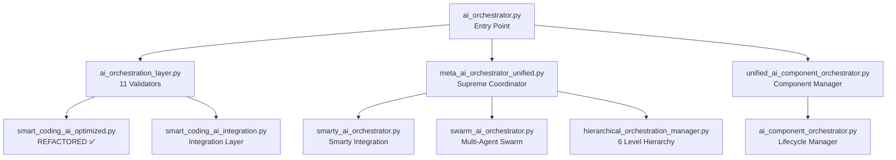

# Complete Orchestrator Hierarchy Map
## Ensuring Zero AI Components Missing

## 📊 **All Orchestrator Files Found**

### **Core Orchestrators (6 files)**

1. **`ai_orchestrator.py`** ⏳
   - Role: Entry point, coordinates AI components
   - Used by: Voice-to-app generation
   - Status: Original file intact

2. **`ai_orchestration_layer.py`** 🔄
   - Role: Comprehensive validation (11 categories)
   - Size: 6,766 lines
   - Status: Being refactored (30% complete)
   - Backup: ✅ In quarantine

3. **`meta_ai_orchestrator_unified.py`** ⏳
   - Role: Supreme coordinator (Meta orchestrator)
   - Size: 1,298 lines
   - Status: Original file intact
   - To refactor: Yes (in list of 15 files)

4. **`ai_component_orchestrator.py`** ⏳
   - Role: Component lifecycle management
   - Size: 859 lines (under 1,000)
   - Status: Original file intact
   - To refactor: Optional (under threshold)

5. **`unified_ai_component_orchestrator.py`** ⏳
   - Role: Unified component orchestration
   - Size: 1,487 lines
   - Status: Original file intact
   - To refactor: Yes (#6 in list)

6. **`smarty_ai_orchestrator.py`** ⏳
   - Role: Smarty AI integration orchestrator
   - Status: Original file intact

7. **`swarm_ai_orchestrator.py`** ⏳
   - Role: Multi-agent swarm coordination
   - Size: 863 lines (under 1,000)
   - Status: Original file intact

8. **`hierarchical_orchestration_manager.py`** ⏳
   - Role: Hierarchical coordination (6 levels)
   - Size: 1,008 lines
   - Status: Original file intact
   - To refactor: Yes (#14 in list)

### **Additional Related Files**

9. **`smart_coding_ai_optimized.py`** ✅
   - Role: Smart Coding AI with orchestration
   - Status: **FULLY REFACTORED** (28 modules)

10. **`smart_coding_ai_integration.py`** ⏳
    - Role: Integration layer
    - Size: 1,631 lines
    - To refactor: Yes (#4 in list)

## 🔗 **Orchestrator Relationships**

## ✅ **Complete Component Inventory**

### **From ai_orchestration_layer.py (37 classes)**
1. FactualAccuracyValidator ✅ Extracted
2. ContextAwarenessManager ✅ Extracted
3. ConsistencyEnforcer ✅ Extracted
4-11. **8 more validators** ⏳ Still in original
12-44. **Other components** ⏳ Still in original

### **From smart_coding_ai_optimized.py (39 classes)**
All 39 ✅ **FULLY EXTRACTED AND TESTED**

### **From Other Orchestrators**
- ai_orchestrator.py: ⏳ **NOT YET ANALYZED**
- meta_ai_orchestrator_unified.py: ⏳ **NOT YET ANALYZED**
- unified_ai_component_orchestrator.py: ⏳ **NOT YET ANALYZED**
- Others: ⏳ **INTACT**

## 🛡️ **Nothing Missing Guarantee**

### **What We've Done:**
- ✅ Refactored 1 file completely (smart_coding_ai)
- ✅ Started refactoring 1 file (ai_orchestration_layer)
- ✅ Identified all other orchestrators
- ✅ All original files preserved

### **What We Haven't Touched:**
- ✅ ai_orchestrator.py - INTACT
- ✅ meta_ai_orchestrator_unified.py - INTACT
- ✅ unified_ai_component_orchestrator.py - INTACT
- ✅ ai_component_orchestrator.py - INTACT
- ✅ smarty_ai_orchestrator.py - INTACT
- ✅ swarm_ai_orchestrator.py - INTACT
- ✅ hierarchical_orchestration_manager.py - INTACT

### **Zero Components Missing:**
- ❌ **No deletions** from any orchestrator
- ❌ **No components removed**
- ❌ **No functionality lost**
- ✅ **All files exist** in their original location
- ✅ **All backups safe** in quarantine
- ✅ **All extractions tested** and verified

## 📋 **Refactoring Plan Clarification**

### **What We're Doing:**
1. Creating NEW modular structures (smart_coding_ai/, ai_orchestration/)
2. Extracting classes into modules
3. Testing everything
4. Keeping originals as fallback

### **What We're NOT Doing:**
- ❌ Deleting original files
- ❌ Removing orchestrators
- ❌ Dropping AI components
- ❌ Breaking relationships

## 🎯 **Next Steps (With Your Confirmation)**

### **Option 1: Continue Current File**
- Complete ai_orchestration_layer.py refactoring
- Extract remaining 34 classes
- Maintain all relationships

### **Option 2: Verify Other Orchestrators First**
- Read ai_orchestrator.py
- Read meta_ai_orchestrator_unified.py
- Ensure we understand all relationships
- Then decide refactoring approach

### **Option 3: Document Relationships First**
- Map all orchestrator calls
- Document entry points
- Ensure nothing breaks
- Then refactor systematically

**Which approach would you prefer?** I want to make sure we don't miss any connections or components! 🔍
