# Cognomega AI - Complete System Architecture

## 🏗️ System Overview

Cognomega AI is a comprehensive Voice-to-App SaaS platform with advanced AI capabilities, featuring multiple AI systems working in harmony through a unified orchestration layer.

## 🎯 Core Architecture Principles

1. **Zero-Cost Infrastructure**: Local AI models with cloud fallbacks
2. **100% Accuracy**: Multi-layer validation and consensus mechanisms
3. **Scalable Design**: Microservices architecture with horizontal scaling
4. **Real-time Processing**: WebSocket-based streaming for instant responses
5. **Autonomous Operations**: Self-managing, self-optimizing AI systems

## 🏛️ System Architecture Diagram

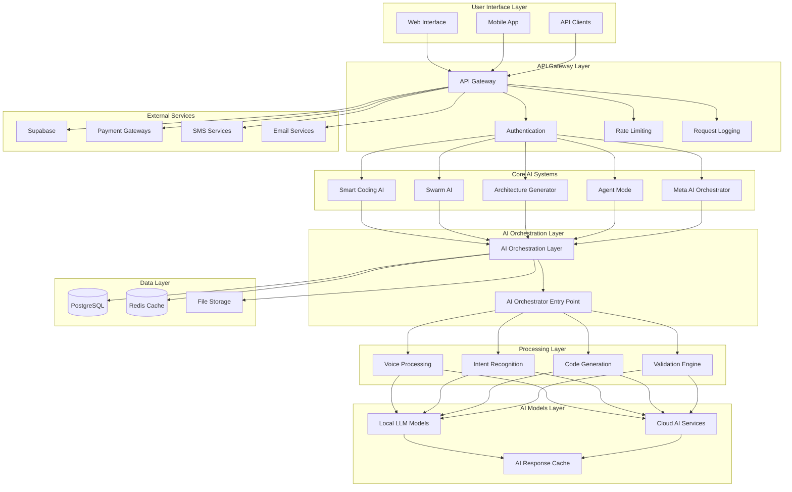

## 🤖 AI Systems Architecture

### **Unified Meta AI Orchestrator**
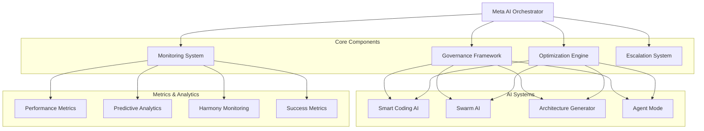

### **Swarm AI System Architecture**
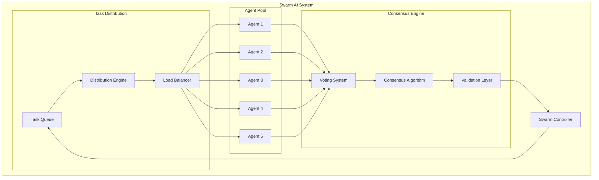

### **Smart Coding AI Architecture**
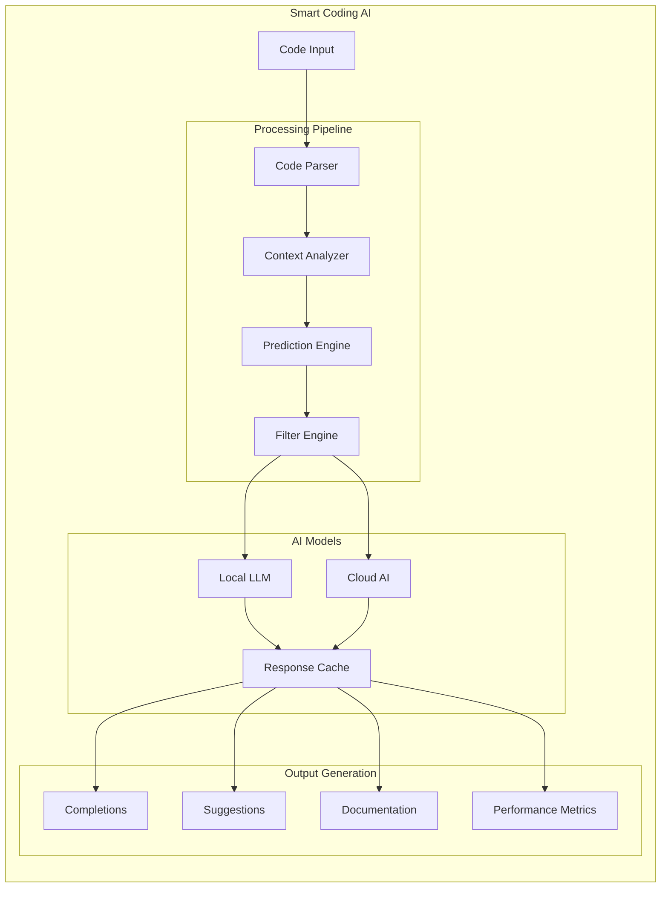

## 🔄 Data Flow Architecture

### **Request Processing Flow**
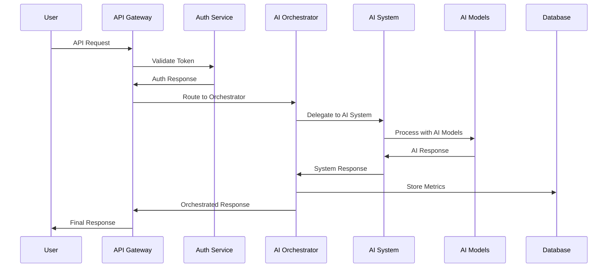

### **Real-time Streaming Flow**
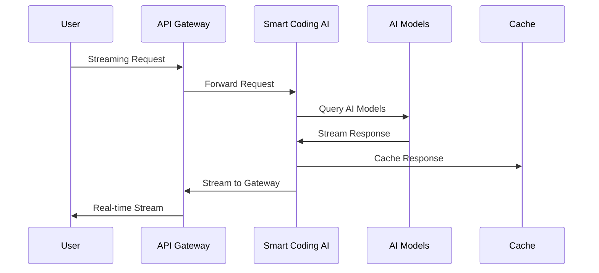

## 🗄️ Database Architecture

### **Core Tables**
```sql
-- Users and Authentication
users (id, email, phone, created_at, updated_at)
user_sessions (id, user_id, token, expires_at)
user_2fa (id, user_id, secret, backup_codes)

-- AI Systems
ai_agents (id, name, type, status, capabilities, created_at)
swarm_sessions (id, name, status, agents, created_at)
architectures (id, name, type, components, created_at)
agent_mode_sessions (id, description, status, files_modified, created_at)

-- Performance Metrics
ai_performance_metrics (id, system, metric_name, value, timestamp)
optimization_history (id, system, optimization_type, results, created_at)
harmony_scores (id, component, score, timestamp)

-- Smart Coding AI
code_completions (id, user_id, code, language, completion, confidence, created_at)
inline_suggestions (id, user_id, code, suggestions, created_at)
performance_metrics (id, response_time, accuracy, cache_hit_rate, timestamp)
```

### **Data Relationships**
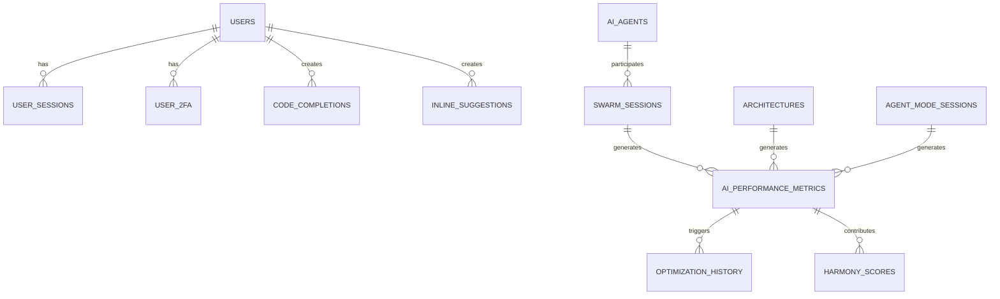

## 🔧 Component Interaction Matrix

| Component | Smart Coding AI | Swarm AI | Architecture Gen | Agent Mode | Meta Orchestrator |
|-----------|----------------|----------|------------------|------------|-------------------|
| **Smart Coding AI** | - | ✅ | ✅ | ✅ | ✅ |
| **Swarm AI** | ✅ | - | ✅ | ✅ | ✅ |
| **Architecture Gen** | ✅ | ✅ | - | ✅ | ✅ |
| **Agent Mode** | ✅ | ✅ | ✅ | - | ✅ |
| **Meta Orchestrator** | ✅ | ✅ | ✅ | ✅ | - |

### **Interaction Types**
- ✅ **Direct Integration**: Components work together directly
- 🔄 **Data Sharing**: Components share data and metrics
- 🎯 **Orchestration**: Meta Orchestrator coordinates all components
- 📊 **Monitoring**: All components report to monitoring systems

## 🚀 Deployment Architecture

### **Production Environment**
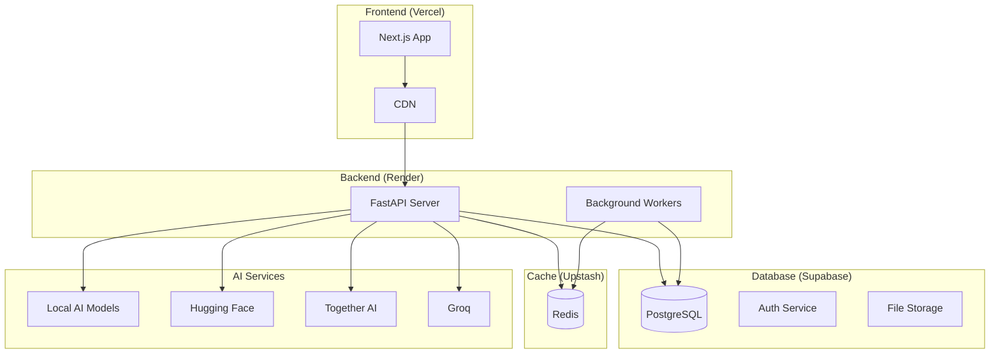

### **Development Environment**
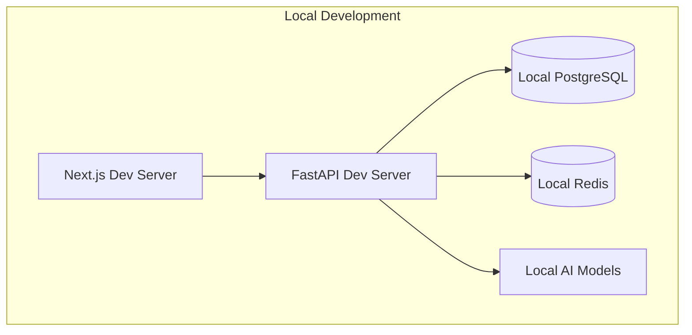

## 📊 Performance Architecture

### **Caching Strategy**
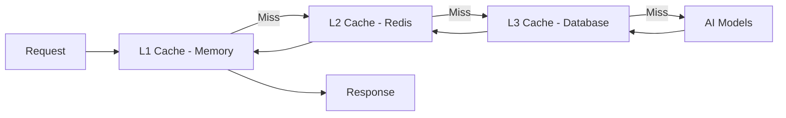

### **Load Balancing**
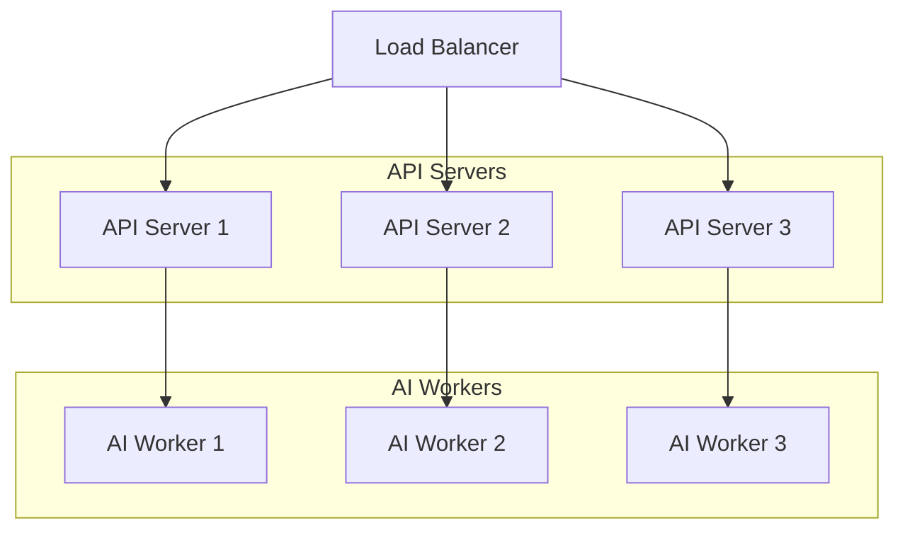

## 🔒 Security Architecture

### **Authentication Flow**
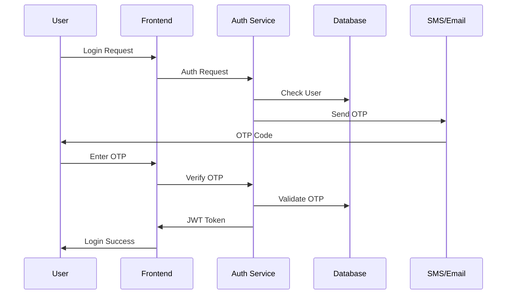

### **API Security Layers**
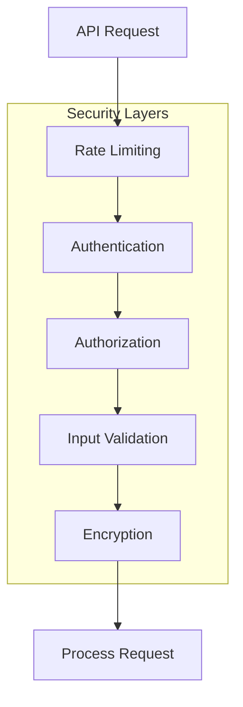

## 📈 Monitoring Architecture

### **Metrics Collection**
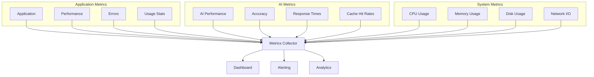

## 🎯 Scalability Architecture

### **Horizontal Scaling**
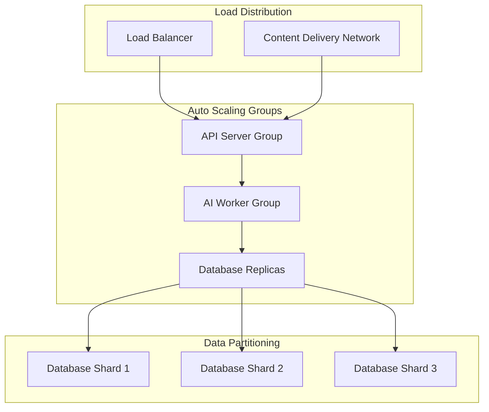

---

**Architecture Version**: 1.0.0  
**Last Updated**: January 2024  
**Maintainer**: Cognomega AI Team
